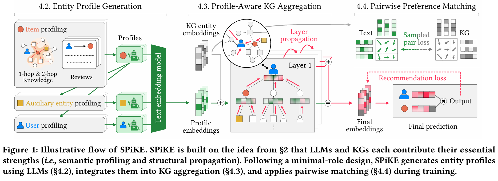

# SPiKE-pytorch
Official PyTorch implementation of **SPiKE** (**S**emantic **P**rofiles **i**nto **K**nowledge Graphs for **E**nhanced Recommendation, KDD'26).

This implementation is built upon the codebase of **SSLRec** (https://github.com/HKUDS/SSLRec).
<p align="center">
  
</p>

## Abstract

<p align="justify">
Rich and informative profiling to capture user preferences is essential for improving recommendation quality. However, there is still no consensus on how best to construct and utilize such profiles. To address this, we revisit recent profiling-based approaches in recommender systems along four dimensions: 1) knowledge base, 2) preference indicator, 3) impact range, and 4) subject. We argue that large language models (LLMs) are effective at extracting compressed rationales from diverse knowledge sources, while knowledge graphs (KGs) are better suited for propagating these profiles to extend their reach. Building on this insight, we propose a new recommendation model, called **SPiKE**. SPiKE consists of three core components: i) Entity profile generation, which uses LLMs to generate semantic profiles for all KG entities; ii) Profile- aware KG aggregation, which integrates these profiles into the KG; and iii) Pairwise profile preference matching, which aligns LLM- and KG-based representations during training. In experiments, we demonstrate that SPiKE consistently outperforms state-of-the-art KG- and LLM-based recommenders in real-world settings.
</p>

## Environment Requirements

Please install core required dependencies:

    pip install -r requirements.txt

## Supported Datasets

SPiKE supports benchmark recommendation datasets with knowledge graphs:

- Amazon-Books  
- Amazon-Movies & TV  
- Yelp  

Please download the datasets (Full datasets will be released soon!) from the following link:

https://drive.google.com/drive/folders/19Q2Tpec2pcq7Y9lNjFdjTA41vwNefmp6?usp=drive_link

After downloading, place the datasets in the following directory structure:

```text
spike/
└── dataset/
    └── kg/
        ├── amazon-book_kg/
        ├── amazon-movie_kg/
        └── yelp_kg/
```

> **⚠️ Important note**
> 
> **We observe that prior LLM- and KG-based recommendation studies often report inconsistent statistics even on the same dataset.**  
> To ensure fair and reproducible comparisons, we reorganize the data processing pipeline based on prior works to support both LLM- and KG-based recommendation (See Appendix A in our paper).  


## Training & Evaluation

Example command:

    python run.py \
      --dataset book \
      --model spike \
      --gpu 0

Please refer to the original **SSLRec** implementation for a detailed description of all supported arguments.


## Citation

If you would like to cite this paper, please make a copy of the following text. Thank you 🤣

```bibtex
@article{ahn2026spike,
  title={Enriching Semantic Profiles into Knowledge Graph for Recommender Systems Using Large Language Models},
  author={Ahn, Seokho and Shin, Sungbok and Seo, Young-Duk},
  journal={Proceedings of the 32nd ACM SIGKDD Conference on Knowledge Discovery and Data Mining V. 1},
  year={2026}
}
```
